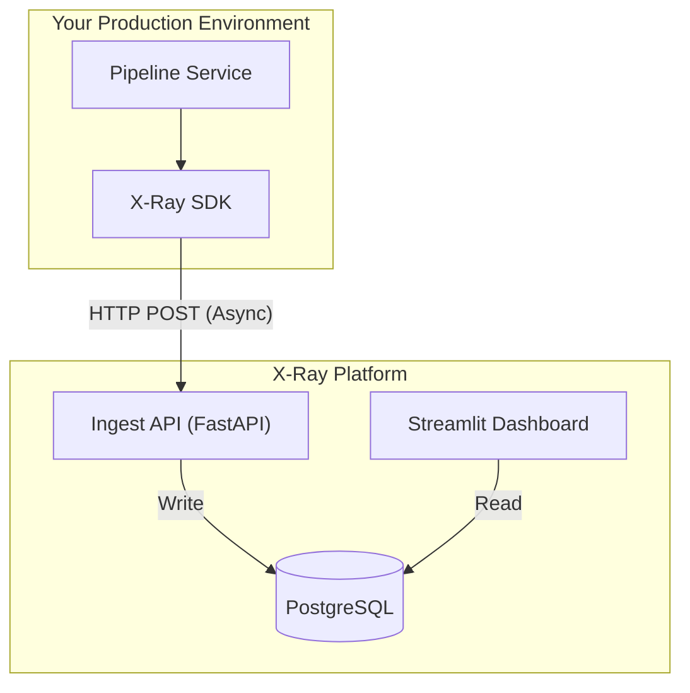
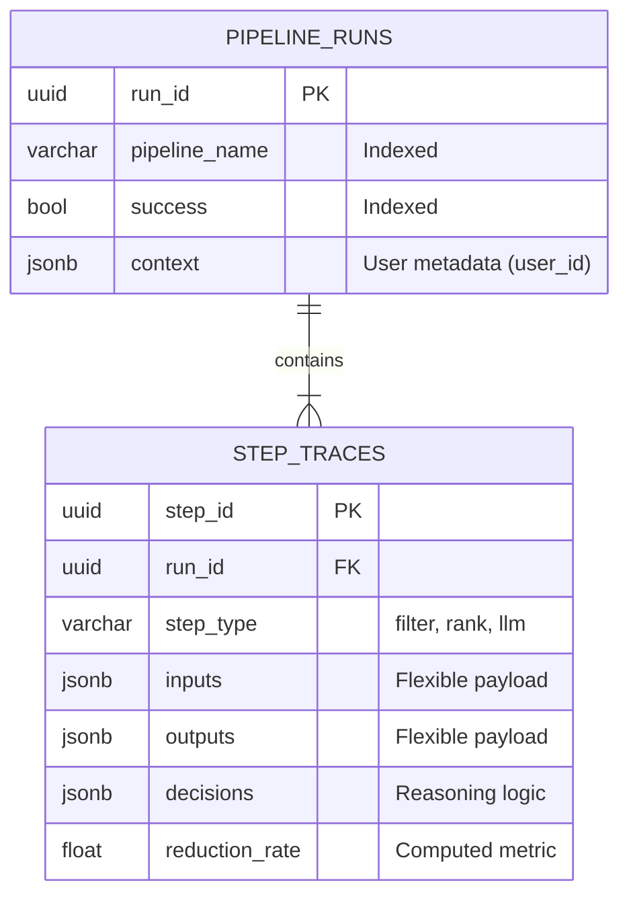

# X-Ray System Architecture

## 1. High-Level Design

X-Ray is designed as a decoupled observability layer that sits alongside your production pipelines.



### Design Principles
1.  **Do No Harm**: The SDK defaults to `fail_silently=True`. If X-Ray goes down, your production pipeline **must** continue running.
2.  **"Why" over "What"**: Unlike Datadog/Jaeger (latency/errors), X-Ray focuses on **Data Context** (candidates, decisions, reasoning).
3.  **Queryable Metadata**: Structured steps allow cross-pipeline analytics (e.g., "Find all bad LLM outputs regardless of pipeline").

---

## 2. Core Data Model

We chose a **Hybrid Relational + JSON** model on PostgreSQL.

### Use Case
We need to query **structured fields** (success rate, duration) globally, but store **unstructured context** (LLM prompts, candidate lists) flexibly.

### Schema Design



### Trade-off Analysis: PostgreSQL vs. MongoDB

**PostgreSQL chosen** for SQL aggregations (cross-pipeline queries), foreign key integrity, and JSONB flexibility. **MongoDB rejected** due to complex aggregation pipelines and lack of strict schema enforcement. Write performance trade-off (5k vs 20k ops/sec) is acceptable—async queueing handles extreme scale.

---

## 3. Handling Scale: The "5,000 Candidate" Problem

**Problem**: A filtering step takes 5,000 items and returns 50. Sending full details for 4,950 rejected items creates massive network/storage overhead.

**Solution: "Smart Summary" Mode**
The SDK allows developers to capture *aggregated* reasoning for high-cardinality steps.

**Developer Implementation:**
```python
# Instead of logging 5,000 objects:
with run.step("massive_filter", sample_rate=0.1) as step:
    # filtering logic..
    
    # Send Summary
    step.set_output({
        "input_count": 5000,
        "output_count": 50,
        "rejected_reasons": {
            "price_too_high": 4200,
            "rating_too_low": 750
        }
    })
```

**System Handling:**
1.  **Ingest Protection**: API rejects payloads > 10MB (configurable).
2.  **Sampling**: SDK only sends detailed object data for a random sample (e.g., 5 kept, 5 rejected) to allow "spot check" debugging without full storage costs.

---

## 4. Debugging Walkthrough

**Scenario**: A user reports that the competitor selection pipeline selected an **irrelevant product** for a given user.

### Step 1: Find the Run
Query the API for the specific user's runs.

```bash
GET /api/runs?pipeline_name=competitor_selection&context={"user_id": "user_123"}
```

### Step 2: Inspect the Decisions (The "X-Ray" View)
We retrieve the trace and look at the `ranking` step.

**API Response (Simplified):**
```json
{
  "step_name": "ranking",
  "step_type": "llm_rank",
  "inputs": {"criteria": "price_similarity"},
  "outputs": {"winner_id": "competitor_456"},
  "decisions": [
    {
      "action": "ranked_first",
      "reason": "Price $50 is closest to target $48",
      "metadata": {
        "score": 0.98,
        "model": "gpt-4-turbo"
      }
    }
  ]
}
```

### Step 3: Root Cause Analysis
**Insight**: The `reason` field reveals the ranking model is strictly prioritizing price similarity over feature parity.
**Fix**: Update the ranking prompt to weight feature overlap higher than price difference.

---

## 5. Cross-Pipeline Queryability

Because we enforce a schema on `step_type`, we can answer questions that span *multiple* pipelines.

**Business Question**: "Are our filters too aggressive across the entire platform?"

**SQL Query:**
```sql
SELECT 
    pipeline_name, 
    AVG(reduction_rate) as avg_reduction
FROM step_traces 
WHERE 
    step_type = 'filter' 
    AND created_at > NOW() - INTERVAL '7 days'
GROUP BY 
    pipeline_name
HAVING 
    AVG(reduction_rate) > 0.90; -- Flag pipelines kills >90% of items
```

---

## 6. Developer Experience

### Minimal Instrumentation
Wrap existing pipeline in context managers:
```python
from xray_sdk import XRayTracer

tracer = XRayTracer("competitor_selection", api_url="http://localhost:8000")

with tracer.start_run() as run:
    with run.step("keyword_gen", "llm_call") as step:
        keywords = generate_keywords(product)
        step.set_output({"keywords": keywords})
```

### Full Instrumentation
Add candidate tracking and decision reasoning:
```python
with run.step("price_filter", "filter") as step:
    step.set_input_candidates([Candidate(id=c.id, data=c.data) for c in candidates])

    for c in candidates:
        if not in_price_range(c):
            step.add_decision("filtered_out", f"Price ${c.price} out of range")

    step.set_output_candidates(kept)
```

### Graceful Degradation
SDK defaults to `fail_silently=True`. If API is unreachable, traces are dropped but your pipeline continues. Use `enabled=False` env variable as a production kill switch.

---

## 7. Future Considerations

### 1. Async Ingestion (Redis/Celery)
*   **Current**: SDK sends HTTP POST at end of run (Blocking ~50ms).
*   **Future**: SDK writes to local sidecar or UDP; Agent forward to Redis Queue. Workers bulk-insert to Postgres.
    *   *Why?* Decouples application latency from observability.

### 2. Blob Storage Offloading
*   **Current**: All data in Postgres.
*   **Future**: Move raw `candidates` lists to S3. Keep only `metadata` and `decisions` in Postgres.
    *   *Why?* Postgres storage is expensive; S3 is cheap. We rarely query inside the full candidate JSON objects.

### 3. Tail Sampling
*   **Current**: `sample_rate` is static.
*   **Future**: Keep 100% of *failed* runs and only 1% of *successful* runs.

---

## 8. API Specification

### Runs

**`GET /api/runs`**
List all pipeline runs with optional filters.
*   **Parameters**:
    *   `pipeline_name` (string): Filter by pipeline name (e.g. `competitor_selection`, `product_categorization`)
    *   `success` (boolean): `true` or `false`
    *   `context` (json): JSON subset match on context field.
        *   Example: `{"user_id": "usr_8f92a1b3c4d5"}` or `{"sku": "8402451-DK"}`
*   **Response**: List of `PipelineRunSummary` objects.

**`POST /api/runs`**
Ingest a new run (used by SDK).
*   **Payload**: Full `PipelineRunCreate` object including all steps and metadata.

### Analytics

**`GET /api/steps`**
Query individual steps across all runs.
*   **Parameters**:
    *   `step_type` (string): e.g. `llm_call`, `filter`
    *   `min_reduction_rate` (float): 0.0 to 1.0 (find aggressive filters)
    *   `min_duration_ms` (float): Find slow steps
*   **Response**: List of `StepTraceSchema` objects.

